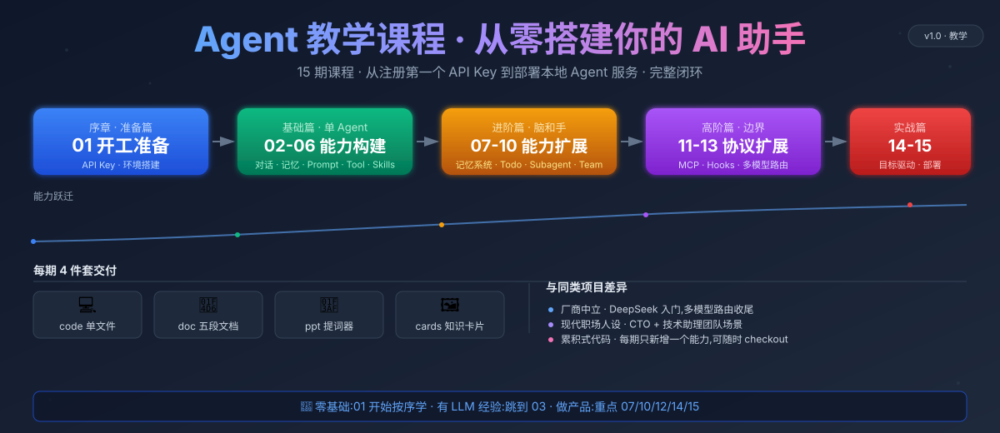

# Agent 教学课程 · 从零搭建你的 AI 助手



> 一个面向开发者的 Agent 实战教学项目,从注册第一个 API Key 到部署一个能用的本地 Agent 服务,完整闭环。

## 项目定位

这不是一个生产框架,而是把 Agent 的关键零件逐一拆开讲清楚。每一期保留前期全部代码,只新增一个能力,学员可以随时 checkout 到任意一期继续学习。

**与同类项目的差异:**

- 厂商中立:以 DeepSeek 为入门示例(便宜、国内可访问),后期展示多模型路由
- 现代职场人设:用"创业公司 CTO + 技术助理团队"场景,贴近开发者日常
- 每期 4 件套:代码 + 文档 + PPT + 知识卡片

## 课程地图(15 期)

### 序章 · 准备篇

| 期号 | 主题 | 知识点 |
|---|---|---|
| 01 | 认识 Agent + 开工准备 | LLM vs Agent / 注册 DeepSeek / 充值 API Key / 环境搭建 / 第一次调用 |

### 基础篇 · 单 Agent 能力构建

| 期号 | 主题 | 知识点 |
|---|---|---|
| 02 | 单次调用 → 连续对话 | API 调用、循环、无记忆痛点 |
| 03 | 短期记忆 history | messages[] 回灌、上下文长度限制 |
| 04 | System Prompt 人设 | 角色设定、约束行为 |
| 05 | Tool Use 工具调用 | 工具循环、JSON schema、tool_result |
| 06 | Skills 按需加载 | SKILL.md frontmatter、知识注入 |

### 进阶篇 · Agent 的"脑子"和"手"

| 期号 | 主题 | 知识点 |
|---|---|---|
| 07 | 记忆系统 | raw history / 长期记忆 / 用户画像 / compact |
| 08 | 任务规划 TodoList | todolist、单 in_progress 约束 |
| 09 | 子代理 Subagent | 独立上下文、工具白名单、并发派遣 |
| 10 | Agent Team 团队协作 | 持久队友、inbox、消息广播 |

### 高阶篇 · 边界与扩展

| 期号 | 主题 | 知识点 |
|---|---|---|
| 11 | MCP 协议 | stdio transport、外部工具服务器 |
| 12 | Hooks 生命周期 | Before/After 拦截、改写、审计 |
| 13 | 多模型路由 | DeepSeek / Claude / 本地模型切换、成本 telemetry |

### 实战篇 · 收尾

| 期号 | 主题 | 知识点 |
|---|---|---|
| 14 | 目标驱动 Agent | goal contract、控制循环、checkpoint |
| 15 | 部署上线 + 课程总结 | Web UI、流式响应、Docker 部署 |

## 每期产出物(4 件套)

每期统一交付,降低录课难度:

| 文件 | 说明 |
|---|---|
| `code/stepNN_xxx.py` | 累积式可运行代码,单文件 |
| `doc/stepNN_xxx.md` | 统五段结构:问题 → 方案 → 原理 → 变更 → 试一试 |
| `ppt/第NN期-xxx.html` | 单页 HTML 课件(内容即提词器,无需独立口播稿) |
| `cards/第NN期-知识点.md` | 一张图能看懂的知识卡片 |

> PPT HTML 本身就是提词器:每页的标题、要点列表、代码块、提示卡片就是录制时要讲的内容,看着自由发挥即可,不另写口播稿。

## 快速开始

```bash
python -m venv .venv
source .venv/bin/activate                 # Windows: .venv\Scripts\activate
pip install -r requirements.txt

cp .env.example .env                      # 填入 DEEPSEEK_API_KEY
python code/step01_hello_agent.py
```

## 目录结构

```text
agent-teaching-course/
├── code/          step01-step15 教学代码
├── doc/           step01-step15 同名讲解文档
├── ppt/           课程 HTML 课件(内容即提词器)
├── cards/         知识卡片(公众号/B站封面)
│
│  ===== 以下目录"按需引入",对应期号才出现 =====
├── templates/      第 04 期起:Agent 人设(SOUL.md)
├── skills/        第 06 期起:演示技能(weather 等)
├── memory/        第 07 期起:Agent 运行时记忆存储
└── assets/        图片等资源
```

**累积式原则**:运行时资源按对应期号引入,前 6 期项目里不会出现 `templates/` `skills/` `memory/`。

**作者私有**:`.local/` 目录被 `.gitignore` 忽略,不提交。

## 学习路径建议

- 零基础:从第 01 期开始,按序学完
- 有 LLM 经验:跳过 01-02,从 03 history 开始
- 想做产品:重点看 07 记忆、10 团队、12 hooks、14 目标驱动、15 部署
